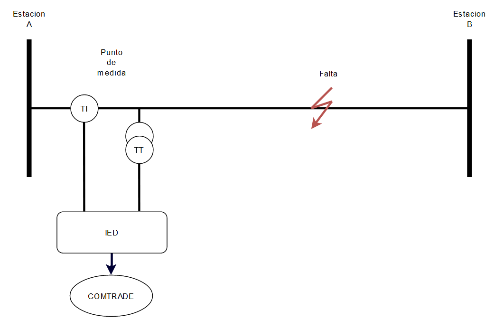
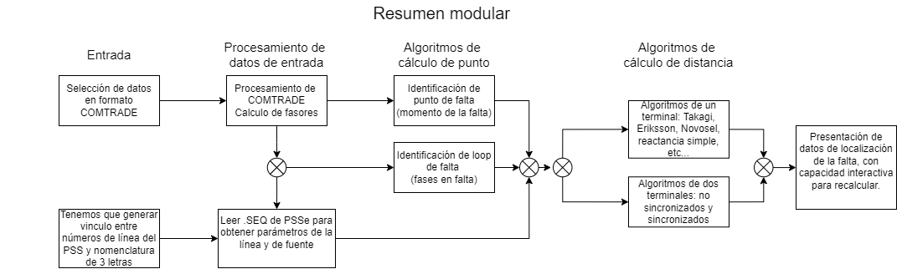
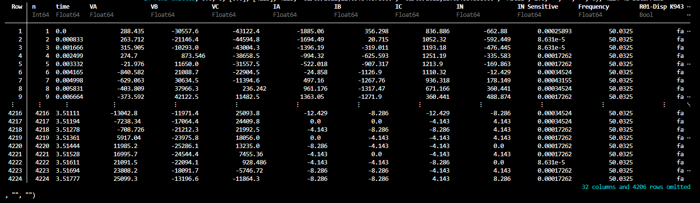

# LocalizadorJulia
## Objetivo del proyecto
Calcular a que distancia ocurre una falta en una línea o cable de un sistema eléctrico de potencia, partiendo desde un archivo [COMTRADE](https://en.wikipedia.org/wiki/Comtrade) generado por los IED de protección y usando [Julia](https://julialang.org/) para implementar los siguientes algoritmos:
* Detección de fase en falta, para identificar que fase o fases fallaron).
* Cálculo del tiempo de falta, es decir en qué momento del registro fue la falta.
* Cálculo de distancia a la falta, en Ohm y en metros si se cuenta con el dato de impedancia por kilómetro de la línea o cable, usando varios algoritmos por ejemplo reactancia simple, Takagi, Novosel, Eriksson, etc.
* Mostrar resultados de forma amigable.

## Diagrama modular del proyecto
En el caso del curso no se aplicará la interacción con PSSE

## Pasos previos
Ya existe en Julia una libreria que toma archivos COMTRADE y devuelve en DataFrame. Esa librería fue hecha para las primeras versiones de Julia y está actualmente desatendida (7 años) por lo que fué necesario crear un fork y modificar algunas cosas para que sea compatible con las versiones actuales que usan proyect.toml y manifest.toml.
## Algoritmos a implementar
### Obtención de fasores
Los archivos COMTRADE contienen la información de las distintas magnitudes en su forma instantánea, pero para poder aplicar los distintos algoritmos, es necesario traducir los datos a fasores (RMS). Un método habitual para la estimación de fasores es el del promeidio la ventana móvil.
### Lazo de falta
Para poder realizar la detección de la distancia a la falta, primero es necesario saber el tipo de falta, es decir cuáles  de las fases fallaron, por ejemplo:
* Fases A y B (cortocircuito bifásico).
* Fase C y G (cortocircuito monofásico a tierra).
* Fases A, B y G (cortocircuito bifásico a tierra).
* Fases A, B y C (cortocircuito trifásico).
### Tiempo de falta
También en necesario saber en que moménto fué la falta
### Impedancia/distancia de falta
Una vez que se tienen los algoritmos anteriores se puede proceder a calcular la impedancia de falta por algoritmos tales como:
* Reactancia simple
* Takagi
* Novosel
* Eriksson
* Etc...
## Ejemplos
### Ejemplo de DataFrame de datos de un COMTRADE

En el DataFrame se pueden ver los valores intantáneos de los canales de tensión y corriente.
### Ejemplo de oscilografia de falta CG en visor COMTRADE
En la imagen se puede ver la oscilografía de una falta entre la fase C y tierra.
Se puede observar que el la tensión de la fase C (canal 3)
disminuye y la corriente de la fase C (canal 6) aumenta.

